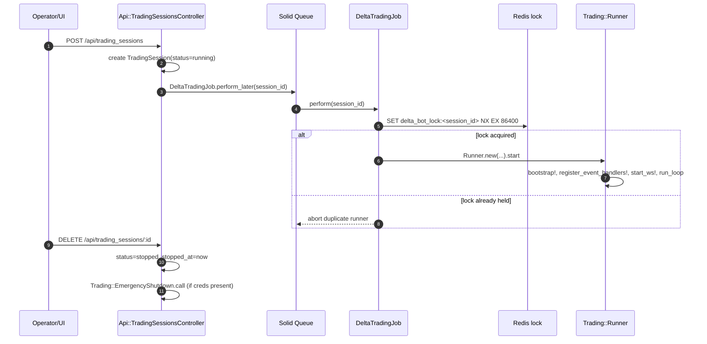
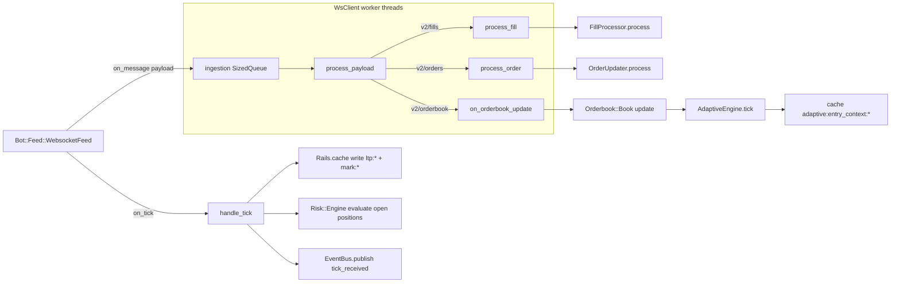
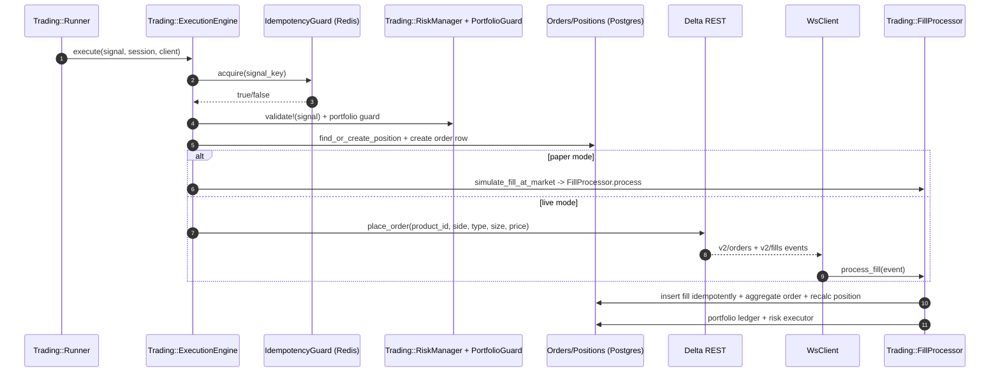

# Delta Exchange Bot Architecture Diagrams (Canonical `backend/` Runtime)

This document maps how the current Rails runtime works end-to-end and how each major component behaves internally.

> Canonical runtime: `backend/` Rails app (`Trading::Runner`, JSON API, **Solid Queue** jobs, Postgres, Redis + `Rails.cache`, Delta REST/WebSocket, optional Telegram).

## 1) High-level system architecture (all components + interactions)

```mermaid
flowchart LR
    subgraph UI[Operator & UI]
      FE[Frontend/Vite Dashboard]
      OPS[Ops/SRE]
    end

    subgraph API[Rails API + Jobs]
      AC[ApplicationController\nAPI token auth]
      TSC[Api::TradingSessionsController]
      SQ[Solid Queue / ActiveJob]
      DTJ[DeltaTradingJob]
    end

    subgraph Runtime[Trading Runtime Process]
      RUN[Trading::Runner]
      BUS[Trading::EventBus]
      WS[Trading::MarketData::WsClient]
      STRAT[Bot::Strategy::MultiTimeframe]
      EXEC[Trading::ExecutionEngine]
      RISK[Trading::Risk::*]
      FILL[Trading::FillProcessor]
      OUPD[Trading::OrderUpdater]
      HND[Trading::Handlers::*]
    end

    subgraph Data[State & Persistence]
      PG[(Postgres)]
      REDIS[(Redis\nlocks + cache)]
      RC[Rails.cache]
    end

    subgraph Exchange[External]
      DELTA[Delta Exchange REST/WS]
      TG[Telegram]
    end

    FE -->|HTTP JSON| AC
    OPS -->|Start/Stop Session| TSC
    AC --> TSC
    TSC -->|perform_later(session_id)| SQ
    SQ --> DTJ
    DTJ -->|acquire delta_bot_lock:*| REDIS
    DTJ --> RUN

    RUN <--> BUS
    RUN --> STRAT
    RUN --> EXEC
    RUN --> WS
    WS <-->|public+private WS| DELTA
    EXEC <-->|orders REST| DELTA

    WS -->|tick/order/fill events| BUS
    BUS --> HND
    WS --> OUPD
    WS --> FILL

    EXEC --> RISK
    FILL --> RISK

    RUN --> PG
    EXEC --> PG
    FILL --> PG
    OUPD --> PG
    HND --> PG

    WS --> RC
    RUN --> RC
    RC --> REDIS

    RUN -->|startup/shutdown + signal notifications| TG
```

## 2) Session lifecycle and process control (API → job → runner)



## 3) Runner internals (strategy pass + event-driven risk loop)

```mermaid
flowchart TD
    A[Runner.start] --> B[notify_startup_status]
    B --> C[bootstrap!]
    C --> C1[ensure_symbols_configured!]
    C1 --> C2[ProductCatalogSync.sync_all!]
    C -->|live mode| C3[Bootstrap::SyncPositions + SyncOrders]
    C -->|paper mode| C4[skip exchange bootstrap]

    C --> D[register_event_handlers!]
    D --> D1[order_filled -> Handlers::OrderHandler]
    D --> D2[position_updated -> Handlers::PositionHandler]
    D --> D3[tick_received -> TrailingStopHandler + SmcAlertTickSubscriber]

    D --> E[start_ws! thread]
    E --> F[run_loop every 5s]

    F --> G{strategy interval reached?}
    G -->|yes| H[run_strategy]
    H --> H1[MultiTimeframe.evaluate per symbol]
    H1 --> H2{signal?}
    H2 -->|yes| H3[persist signal + EventBus.publish(signal_generated)]
    H3 --> H4[ExecutionEngine.execute]
    H2 -->|no| H5[build_adaptive_signal from cache]
    H5 --> H4

    F --> I[NearLiquidationExit.check_all]
    F --> J[FundingMonitor.check_all]
    F --> K[sleep 5]
    K --> F
```

## 4) Market data/WebSocket ingestion internals



## 5) Execution/order/fill pipeline (signal to durable state)



## 6) Data ownership + flow map

```mermaid
flowchart TB
    subgraph Postgres
      TS[trading_sessions]
      POS[positions]
      ORD[orders]
      FIL[fills]
      TRD[trades]
      GS[generated_signals]
      SC[symbol_configs]
      SET[settings]
      PF[portfolios + ledger]
    end

    subgraph RedisAndCache
      LOCK[delta_bot_lock:*]
      IDEM[delta:order:* idempotency]
      LTP[ltp:* / mark:*]
      ADAPT[adaptive:entry_context:*]
      RUNTIME[runtime_config:*]
      ADASH[delta:analysis:dashboard]
      SMCAL[delta:smc_alert:*]
    end

    API[API controllers] --> TS
    API --> SET
    Runner[Trading::Runner] --> GS
    Runner --> SC
    Execution[ExecutionEngine] --> ORD
    Execution --> POS
    WsFill[FillProcessor/OrderUpdater] --> FIL
    WsFill --> ORD
    WsFill --> POS
    Handlers[Handlers::OrderHandler] --> TRD
    Risk[Risk + liquidation logic] --> PF

    DeltaWS[Delta WS ticks] --> LTP
    DeltaWS --> ADAPT
    Runner --> IDEM
    DeltaTradingJob --> LOCK
    RuntimeConfig[Trading::RuntimeConfig] --> RUNTIME
```



## 7) Notes for contributors

- Run exactly one long-lived runner per session (`delta_bot_lock:<session_id>` prevents duplicate job dispatch, but separate manually started processes can still collide).
- `Trading::EventBus` is in-process global state; `Runner#start` calls `EventBus.reset!` on shutdown.
- In paper mode, fills are generated locally by `ExecutionEngine#simulate_fill_at_market`; in live mode, fills/orders arrive from exchange WS streams and are reconciled by `FillProcessor`/`OrderUpdater`.
- Strategy pass cadence and WS ingestion throughput are runtime-tunable (`runner.strategy_interval_seconds`, `WS_INGESTION_WORKERS`, queue size, etc.).
- **SMC Telegram event alerts** (`SmcAlertTickSubscriber` on `tick_received`) run only inside the same OS process as `Trading::Runner`; the 15m **`AnalysisDashboardRefreshJob`** is independent and writes `delta:analysis:dashboard`. See [`smc_event_alerts.md`](smc_event_alerts.md).
