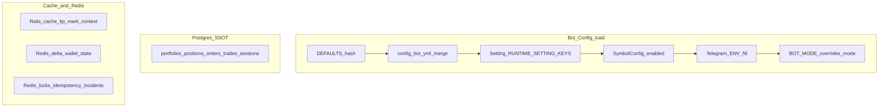

# Configuration and runtime data precedence

Canonical Rails app: `backend/`. This document describes **where truth lives** for bot configuration, durable trading state, and ephemeral caches so changes land in the right layer.

## Bot configuration (`Bot::Config.load`)

Runtime config is built in [`app/services/bot/config.rb`](../app/services/bot/config.rb) (`runtime_raw` → `load`). Precedence:

1. **In-code `DEFAULTS`** — baseline nested hash (including `risk.usd_to_inr_rate`).
2. **`config/bot.yml`** — deep-merged only for keys that already exist under `DEFAULTS` (YAML-only keys such as a duplicate symbol list are ignored; the watchlist comes from the DB).
3. **`Setting` rows** — keys listed in `RUNTIME_SETTING_KEYS` override the merged hash (including **`risk.usd_to_inr_rate`**).
4. **`SymbolConfig`** — enabled symbols and leverage injected as `symbols` (not from YAML alone).
5. **Environment** — `TELEGRAM_BOT_TOKEN` / `TELEGRAM_CHAT_ID` fill empty telegram fields; `TELEGRAM_ENABLED` can force telegram on; **`BOT_MODE`** overrides top-level `mode` when set.

Paper vs live execution mode is resolved separately in [`app/services/trading/paper_trading.rb`](../app/services/trading/paper_trading.rb): `EXECUTION_MODE` env (`live` / `paper`) wins when set; otherwise paper follows `dry_run?` from config (and non-production defaults).

### USD/INR

Use **`Bot::Config.load.usd_to_inr_rate`** or **`Finance::UsdInrRate.current`** (delegates to config, with a numeric fallback if load fails). Do not read a separate `Setting` key for FX; the stored key is **`risk.usd_to_inr_rate`**.

## Durable state (PostgreSQL)

**Source of truth** for anything that must survive restarts and be auditable:

- Portfolios, positions, orders, trades, trading sessions, fills, signals, settings, symbol configs, etc.

Ledger-style paper wallets use **`Portfolio`** (balance, available, used margin) when a running session is tied to that portfolio.

## Ephemeral and derived data (Rails.cache and Redis)

- **`Rails.cache`** — e.g. `ltp:*`, `mark:*`, adaptive entry context; fed by the market/runner path. Dashboard and risk code may fall back to entry price when cache is cold.
- **Redis** — coordination and snapshots, including:
  - `delta:wallet:state` — wallet payload for live reads and paper publisher writes (`Bot::Account::CapitalManager::REDIS_KEY`)
  - Locks, idempotency, execution incidents, optional live position mirrors

These are **not** replacements for Postgres for durable positions/trades; they are working set or published snapshots.

## Dashboard wallet snapshot

[`Trading::Dashboard::Snapshot#load_wallet_for_dashboard`](../app/services/trading/dashboard/snapshot.rb):

- **Paper trading on** — `PaperWalletPublisher.wallet_snapshot!` recomputes and writes Redis; uses **`Portfolio`** when a **running** `TradingSession` resolves a portfolio, else legacy `CapitalManager` + active positions.
- **Paper off** — reads **`delta:wallet:state`** from Redis (populated by the live/broker path).

Some dashboard INR fields still use a fixed display constant in that service; wallet INR from the publisher uses **`Bot::Config`’s `usd_to_inr_rate`**.

## Diagram

