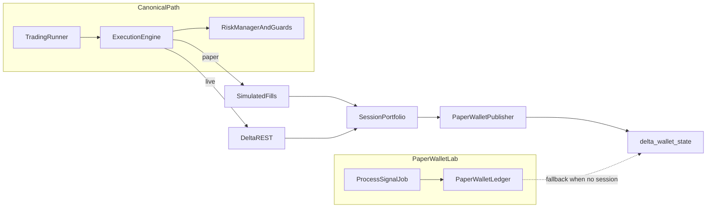

# Paper vs live trading parity

This document describes how **paper** execution diverges from **live** in the canonical Rails runtime (`backend/`), so operators can tune for **production-like paper** vs **fast pipeline testing**. Strategy thresholds (confidence, scores, relaxed filters) are intentionally **out of scope** here — those live in bot config / strategy code and can differ between environments without changing execution plumbing.

**Execution mode resolution:** [`Trading::PaperTrading`](../app/services/trading/paper_trading.rb) — `EXECUTION_MODE=live` forces live; `EXECUTION_MODE=paper` forces paper; otherwise paper follows `Bot::Config` dry-run (and non-production defaults).

---

## Canonical production topology (paper + live)

**Single decision stack for “should we trade?”** Use the long-lived runner: [`Trading::Runner`](../app/services/trading/runner.rb) → [`Trading::ExecutionEngine`](../app/services/trading/execution_engine.rb). That path always runs [`Trading::RiskManager`](../app/services/trading/risk_manager.rb), [`Trading::Risk::PortfolioGuard`](../app/services/trading/risk/portfolio_guard.rb), and (in paper, unless [`PaperRiskOverride`](../app/services/trading/paper_risk_override.rb) is on) paper [`MarginAffordability`](../app/services/trading/risk/margin_affordability.rb). **Live** sends real orders to Delta; **paper** simulates fills in-process (see table below).

**Paper wallet async path** — [`PaperTradingSignal`](../app/models/paper_trading_signal.rb) → [`PaperTrading::ProcessSignalJob`](../app/jobs/paper_trading/process_signal_job.rb) → [`PaperWallet`](../app/models/paper_wallet.rb) / [`PaperTrading::PositionManager`](../app/services/paper_trading/position_manager.rb) — is the **INR ledger + deep simulation** stack (FIFO margin, liquidation, funding, matching). It does **not** reuse `RiskManager` / session `Portfolio` rows. Treat it as a **lab or secondary book**, not as the sole pre-trade gate for production discipline.

**Dashboard / Redis wallet API** — [`Trading::PaperWalletPublisher`](../app/services/trading/paper_wallet_publisher.rb) already prefers a **running session’s `Portfolio`** when one exists; it falls back to **`PaperWallet`** when there is no active portfolio session. That matches “runner is canonical; wallet is mirror when no session.”

**Align runner paper fills with wallet-grade matching** — [`PaperTrading::SimulationProfile`](../app/services/paper_trading/simulation_profile.rb) drives **`PAPER_USE_ORDERBOOK_SIMULATOR`**: explicit env always wins; when **unset**, **production** defaults to **on** (same [`DeltaLikeFillSimulator`](../app/services/paper_trading/delta_like_fill_simulator.rb) as `ProcessSignalJob` — partials, impact, fees into `Fill` / `Portfolio`). **Development and test** default to **off** (legacy instant single-fill for speed). Set `PAPER_USE_ORDERBOOK_SIMULATOR=false` in production only if you need the old instant path.

**Unification roadmap (avoid two divergent “brains” forever):**

1. Prefer **ingress through the runner** (generated signals / `ProcessGeneratedSignalJob`, or future API enqueue that builds the same signal objects the runner consumes).
2. Keep **`PaperWallet`** for INR reporting, stress tests, and exchange-shaped mechanics; optionally add explicit **mirror / projection** from runner fills into the INR ledger later if you need one operator-facing INR view — today the two books remain separate unless you build that bridge.

---

## Operator checklist: “realistic paper”

1. Set **`EXECUTION_MODE=paper`** explicitly (avoid ambiguous dry-run defaults in odd configs).
2. Keep **`paper.ignore_entry_risk_gates`** **off** (dashboard toggle / `Trading::PaperRiskOverride`) so `RiskManager`, `PortfolioGuard`, and paper **`MarginAffordability`** still run — unless you deliberately want to bypass gates for plumbing tests.
3. Align **env limits** with what you use in live: `RISK_MAX_DAILY_LOSS`, `RISK_MAX_EXPOSURE`, `RISK_*` runtime keys, and session **capital / leverage**.
4. Ensure **marks / LTP** are live for symbols you trade: WS + `PaperTrading::RedisStore` LTP (catalog fallbacks are not a substitute for production marks).
5. Accept remaining **structural** gaps below (tracked in root [`TODO.md`](../../TODO.md) under *Paper vs live parity*).

---

## Structural differences (paper cannot match live without further work)

**Two paper execution paths:** (1) **Rails portfolio / runner** — `Trading::ExecutionEngine` + `FillProcessor` + `Portfolio`. (2) **Paper wallet** — `PaperTradingSignal` → [`ProcessSignalJob`](../app/jobs/paper_trading/process_signal_job.rb) + `PaperWallet` / `PositionManager`. Both can use shared [`DeltaLikeFillSimulator`](../app/services/paper_trading/delta_like_fill_simulator.rb) (`OrderBook` → `MatchingEngine` → `ImpactModel`).

| Area | Live behavior | Paper behavior | Primary references |
|------|----------------|----------------|-------------------|
| **Order placement** | REST `place_order` to Delta | **(1)** Skipped — `simulate_fill_at_market` (**instant**, fee `0`) when orderbook sim is **off**; **`PAPER_USE_ORDERBOOK_SIMULATOR`** (see `PaperTrading::SimulationProfile`: **on by default in production** when env unset) uses the same synthetic book as (2) and emits **multiple** `FillProcessor` events with **taker fees** (`PaperTrading::Fees`, `PaperProductSnapshot` or stub). **(2)** Synthetic `PaperOrder` + simulator + [`FillApplier`](../app/services/paper_trading/fill_applier.rb) (slippage/delay per fill). | [`execution_engine.rb`](../app/services/trading/execution_engine.rb), [`simulation_profile.rb`](../app/services/paper_trading/simulation_profile.rb), [`process_signal_job.rb`](../app/jobs/paper_trading/process_signal_job.rb) |
| **Fill realism** | Exchange partials, rejects, latency, slippage | **(1)** Legacy: single fill, fee `0`. Flagged: partials, impact, fees; **`PAPER_LIMIT_FILL_STRICT`**: empty book / non-crossing **limit** → `RiskError` (no fallback). **(2)** Same book; optional delay in `FillApplier`; reject on no liquidity. **`Portfolio`**: `apply_fill_and_sync!` debits **`fill.fee`** from balance (wallet delta = realized PnL − fee). | [`delta_like_fill_simulator.rb`](../app/services/paper_trading/delta_like_fill_simulator.rb), [`portfolio.rb`](../app/models/portfolio.rb) |
| **Private WebSocket** | Can subscribe to private streams (orders/fills) | **`subscribe_private_streams: false`** — avoids mixing exchange account state with simulated positions; allows running with empty API keys | [`paper_trading.rb`](../app/services/trading/paper_trading.rb), [`market_data/ws_client.rb`](../app/services/trading/market_data/ws_client.rb) |
| **Runner bootstrap** | `Bootstrap::SyncPositions` + `SyncOrders` from exchange | **Skipped** — log line “Paper mode — skipping exchange position/order bootstrap” | [`runner.rb`](../app/services/trading/runner.rb) |
| **Delta client credentials** | `ENV.fetch` API key/secret | **Optional** keys — `RunnerClient` allows blank credentials in paper | [`runner_client.rb`](../app/services/trading/runner_client.rb) |
| **Near-liquidation exit** | LTP vs `liquidation_price` watchdog | **Disabled** (`return if PaperTrading.enabled?`) | [`near_liquidation_exit.rb`](../app/services/trading/near_liquidation_exit.rb) |
| **Emergency shutdown flatten** | Cancel open orders + market close per position on exchange | **No exchange orders** — `force_exit_position` only updates DB via `OrdersRepository.close_position` after skipping `place_order` | [`emergency_shutdown.rb`](../app/services/trading/emergency_shutdown.rb) |
| **Open order cancellation** | Cancels by `exchange_order_id` when present | **Skipped** in paper for the same guard | [`emergency_shutdown.rb`](../app/services/trading/emergency_shutdown.rb) |
| **Synthetic close PnL / wallet** | Fills drive portfolio via exchange | Paper: **`OrdersRepository`** may **`credit_portfolio_balance_for_synthetic_close!`** on forced/synthetic closes (no double-count when fills already applied) | [`orders_repository.rb`](../app/repositories/orders_repository.rb) |
| **Paper wallet Redis** | N/A (live uses broker wallet paths) | **`FillProcessor`** → **`PaperWalletPublisher.publish!`** after fills | [`fill_processor.rb`](../app/services/trading/fill_processor.rb), [`paper_wallet_publisher.rb`](../app/services/trading/paper_wallet_publisher.rb) |
| **Dashboard manual close** | Delta client required | Paper: portfolio must match running session; **no** live client | [`dashboard/manual_position_close.rb`](../app/services/trading/dashboard/manual_position_close.rb) |
| **Live margin affordability guard** | Optional extra gate via `RISK_LIVE_MARGIN_AFFORDABILITY_ENABLED` | Uses **paper branch** in `ExecutionEngine` (`MarginAffordability` when override off); not the same env flag path | [`execution_engine.rb`](../app/services/trading/execution_engine.rb) |
| **Funding / carry** | Exchange-accrued funding | **Paper wallet:** [`FundingApplier`](../app/services/paper_trading/funding_applier.rb) + [`ApplyFundingJob`](../app/jobs/paper_trading/apply_funding_job.rb) (`PAPER_FUNDING_INTERVAL_SECONDS`, etc. in [`.env.example`](../.env.example)). **Rails `Portfolio` path:** not the same ledger — still exchange-funding-shaped only if you add an equivalent job. | `paper_trading/funding_applier.rb` |

---

## Optional bypass: paper risk override

**Setting:** `paper.ignore_entry_risk_gates` (boolean), toggled from the API/dashboard as **paper risk override**.

When **on** (and paper is enabled), **`ExecutionEngine`** skips **`PortfolioGuard`** and paper **`MarginAffordability`**; **`RiskManager.validate!`** returns immediately. That is **opposite** of production-like discipline — useful for wiring tests, harmful for realistic wallet/risk rehearsal.

Details: [`paper_risk_override.rb`](../app/services/trading/paper_risk_override.rb), [`risk_manager.rb`](../app/services/trading/risk_manager.rb), [`execution_engine.rb`](../app/services/trading/execution_engine.rb).

---

## Dual sizing / signal pipelines (behavioral fork)

Not strictly “paper vs live,” but **two paths** can produce **different position sizing economics** for similar symbols:

- **Generated signals → `ProcessGeneratedSignalJob`:** [`Trading::Paper::SignalPreflight`](../app/services/trading/paper/signal_preflight.rb) + **`Trading::Paper::CapitalAllocator`** (% of equity, stop-based).
- **Async `PaperTradingSignal` jobs:** [`PaperTrading::ProcessSignalJob`](../app/jobs/paper_trading/process_signal_job.rb) + **`PaperTrading::RrPositionSizer`** (INR max-loss style).

Live **`ExecutionEngine`** sizing still comes from **`OrderBuilder`** / signal payload; comparing “paper wallet” to “live” requires knowing **which ingress** you use.

---

## Mark / LTP sources (synthetic exits and PnL)

**Synthetic exit marks** use [`Trading::MarkPrice.for_synthetic_exit`](../app/services/trading/mark_price.rb): cache → `PriceStore` → **`PaperTrading::RedisStore`** (by `product_id`, with **`SymbolConfig` fallback** if position lacks `product_id`) → `SymbolConfig` catalog → optional entry fallback.

Stale catalog prices (e.g. placeholder **$50,000**) will distort **Telegram exit lines and PnL** if live LTP is missing. **`ExecutionEngine`** now persists **`product_id`** on positions to improve Redis LTP resolution; operators should still verify ticks and Redis keys per product.

---

## Related docs

- [`configuration_precedence.md`](configuration_precedence.md) — config merge, jobs, idempotency.
- Root [`TODO.md`](../../TODO.md) — **Paper vs live parity** backlog items for closing gaps intentionally left open here.
